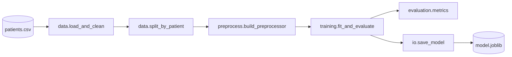

# TP5 — Documentation: docstrings, README, architecture diagram

**Duration:** ~1h
**Tools:** Cursor or Claude Code
**Files you touch:** `README.md`, all modules under `src/`, a new `docs/` folder

---

## Goal

Turn the repository into one a new teammate can understand in **15 minutes**. AI is very good at producing documentation — your job is to make sure it produces **correct**, **specific**, **up-to-date** documentation, not generic filler.

---

## Starting point

- `README.md` is currently four useless lines.
- Most functions have docstrings from TP2, but they may still be thin.
- There is no overview, no setup section, no diagram.

---

## Tasks

### Task 5.1 — Rewrite `README.md`

The new `README.md` should have, at minimum:

1. **Project title and one-paragraph description** — what the project does, for whom, and what the target variable is.
2. **Dataset description** — columns with types, target, class balance, mention the synthetic nature and the leakage trap you identified (so the next person does not fall into it). **Do not** claim the dataset is real.
3. **Setup** — exact commands to create a venv, install deps, and verify the install.
4. **How to run**:
   - the notebook
   - `scripts/train_baseline.py` with its CLI arguments
   - the tests
5. **Project structure** — tree view with a one-line comment per folder/file.
6. **Modelling choices and known caveats** — class imbalance, chosen metric (why AUC > accuracy), CV strategy (why grouped / shuffled), features excluded (especially `length_of_stay` if you treated it as leakage-prone).
7. **How to contribute / develop** — how to add a new model, how to add a test, coding conventions.

### Task 5.2 — Docstrings across `src/`

For every **public** function and class in `src/`:

- One-line summary
- Longer description if non-trivial
- `Parameters` / `Returns` / `Raises` sections (NumPy or Google style — pick one and stick to it)
- A small example in a `>>>` block for at least the 3 most important functions

Use AI like this:

> *Here is a function. Write a NumPy-style docstring. Do not invent parameters that don't exist. Do not describe behaviour that isn't in the code. If the docstring should reference a side effect or a caveat, include it.*

Then **read the docstring against the code**. If the AI hallucinates a parameter or an exception that does not exist, reject the draft.

### Task 5.3 — Architecture diagram

Generate a diagram of the data flow from CSV to saved model. Put it in `docs/architecture.md` (or `docs/architecture.png` if you render it).

Recommended: **Mermaid** in a markdown file — no external tool needed.

Example skeleton (adapt to your TP3 architecture):

````markdown
# Architecture


````

Ask the AI to **generate the Mermaid from your actual code**, not a generic ML diagram. Prompt it with the `src/` file list so it sticks to reality.

### Task 5.4 — A short CONTRIBUTING.md (optional)

- Branching conventions
- How to run the test suite locally
- How to add a new preprocessing step or a new model
- Pre-commit / formatting if you set any up

---

## Acceptance criteria

- [ ] A stranger (the trainer) can follow the `README.md` **from a fresh clone** and have a trained, saved model within 10 minutes.
- [ ] Every public function in `src/` has a complete, accurate docstring. No hallucinated parameters, no outdated descriptions.
- [ ] `docs/architecture.md` exists and matches the **actual** module structure.
- [ ] The README mentions the **leakage trap** around `length_of_stay` (or whatever you concluded in TP2), so the next person does not repeat the mistake.
- [ ] The README mentions that the dataset is **synthetic**.

---

## Deliverables

- Updated `README.md`.
- Updated docstrings across `src/`.
- `docs/architecture.md` with a Mermaid (or equivalent) diagram.
- Optional: `CONTRIBUTING.md`.
- `tp/TP5_log.md` with a 5-line reflection: where did the AI save you time, where did it hallucinate, what would you do next time?

---

## Traps to avoid

- **Marketing-speak in the README** ("cutting-edge", "state-of-the-art"). AI loves these. Strip them.
- **Docstrings that lie.** Read every docstring against the code before committing.
- **Overpromising.** If your AUC is 0.78 and noisy, say so. Do not let the AI write "achieves excellent predictive performance".
- **Generic architecture diagrams.** The diagram must match `src/` — not an idealised ML pipeline.
- **Forgetting to mention the synthetic/leakage trap.** This is the single most useful piece of documentation in this repo.

---

## End of training — wrap-up

When TP5 is done, take 5 minutes to:

1. Re-read the original `README.md` (from `git log` or the initial commit).
2. Re-read your new `README.md`.
3. In `tp/FINAL_reflection.md` (one page max), answer:
   - Which TP did AI help the most with?
   - Which TP did AI help the least with, and why?
   - What is the **one habit** you will keep from these two days?
   - What is the **one pitfall** you noticed in yourself (over-trusting, under-prompting, accepting without reading, etc.)?

That reflection is the real deliverable of the training.
